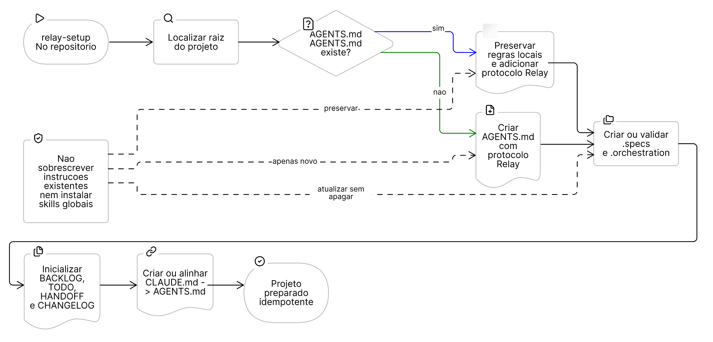
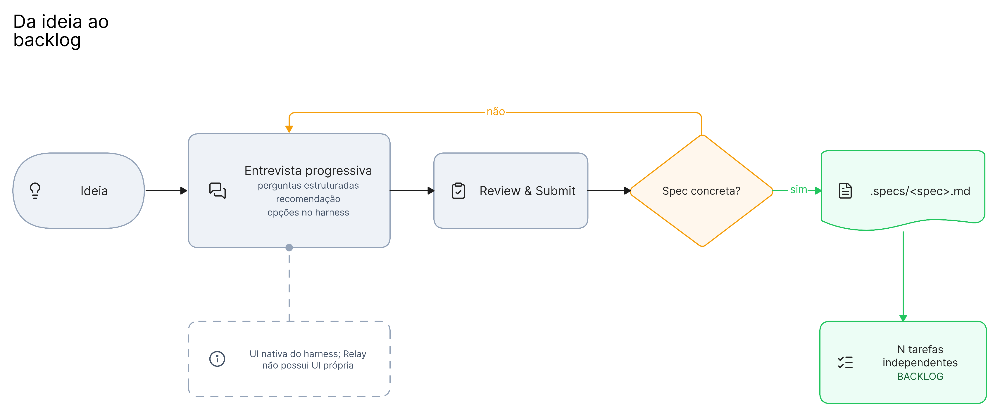
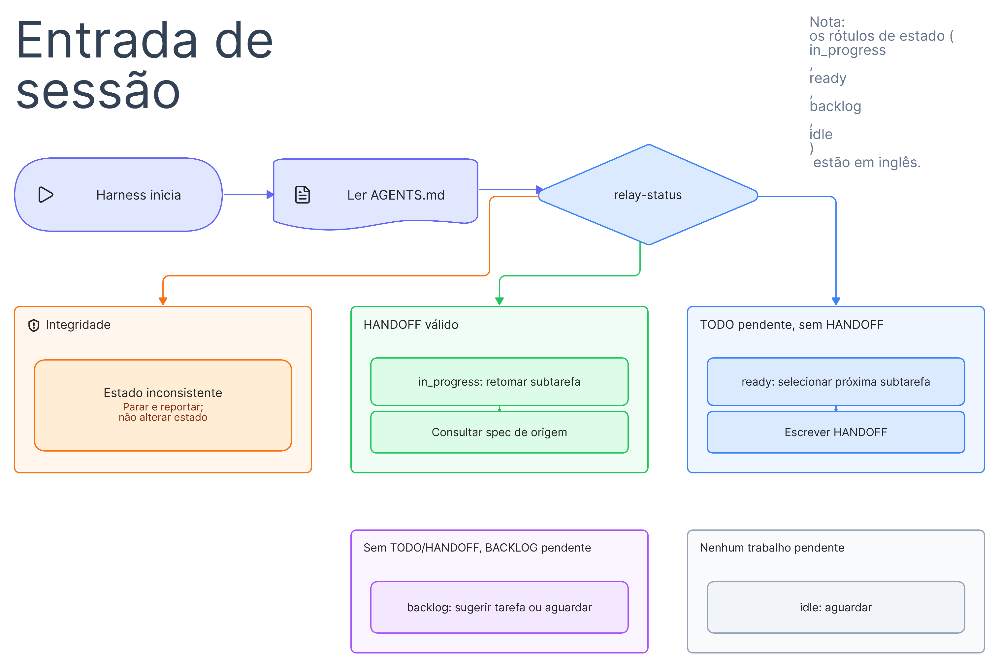
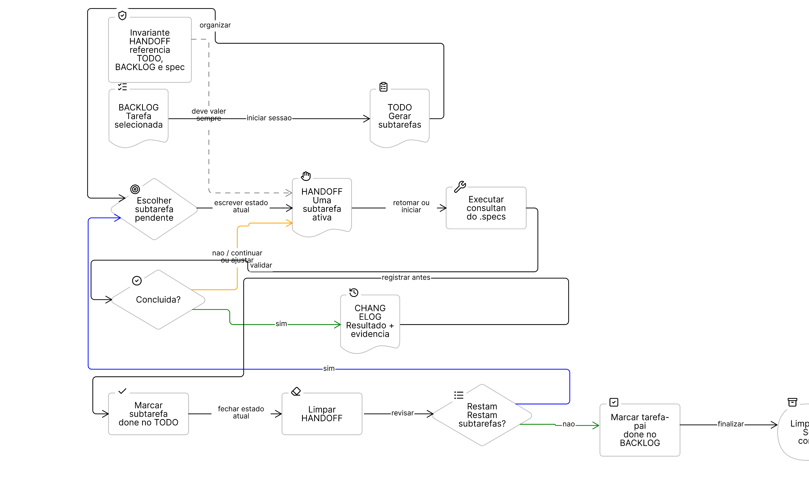

# Relay

## Table of Contents

- [Problema](#problema)
- [Modelo operacional](#modelo-operacional)
- [Fluxo](#fluxo)
- [Fluxos visuais](#fluxos-visuais)
  - [Setup do projeto](#setup-do-projeto)
  - [Da ideia ao backlog](#da-ideia-ao-backlog)
  - [Entrada e retomada de sessao](#entrada-e-retomada-de-sessao)
  - [Ciclo de uma subtarefa](#ciclo-de-uma-subtarefa)
- [Estados](#estados)
- [Inicio de sessao](#inicio-de-sessao)
- [Pacote de skills](#pacote-de-skills)
- [Instalacao](#instalacao)
- [Invariantes](#invariantes)

Relay e um protocolo de memoria operacional portatil para agentes de
desenvolvimento. Ele permite iniciar um trabalho em um harness, interromper no
meio de uma subtarefa e retomar em outro sem depender da memoria do chat
anterior.

O projeto nao tenta substituir especificacoes tecnicas nem um gerenciador de
projetos. Ele padroniza o estado minimo que agentes precisam ler e atualizar
para trabalhar no mesmo repositorio com continuidade.

## Problema

Uma tarefa pode ser especificada no Codex, selecionada no Claude Code e
finalizada por outro harness. Sem um estado compartilhado, o proximo agente
precisa reconstruir a intencao, as decisoes e o ponto exato de execucao.

Relay coloca esse estado no repositorio. `AGENTS.md` e a porta de entrada: todo
harness deve le-lo ao iniciar uma sessao e seguir o protocolo descrito nele.

## Modelo operacional

```text
.specs/
  <spec>.md
.orchestration/
  BACKLOG.md
  TODO.md
  HANDOFF.md
  CHANGELOG.md
AGENTS.md
CLAUDE.md -> AGENTS.md
```

- `.specs/` contem contexto, escopo, decisoes, plano e criterios de aceite.
  E a fonte do "como fazer".
- `BACKLOG.md` contem uma checklist compacta de tarefas implementaveis
  derivadas de specs. Uma spec pode gerar N tarefas de backlog.
- `TODO.md` contem uma checklist compacta das subtarefas da tarefa de backlog
  escolhida para a sessao.
- `HANDOFF.md` contem uma unica subtarefa: o que esta sendo feito agora ou o
  que deve ser retomado agora.
- `CHANGELOG.md` e o team log append-only das subtarefas concluidas, incluindo
  resultado, evidencia e decisoes relevantes.

Arquivos de `.orchestration/` nao repetem detalhes tecnicos da implementacao.
Eles apontam para a spec de origem; os detalhes permanecem em `.specs/`.

## Fluxo

```text
idea -> specification -> .specs/<spec>.md -> N backlog tasks
                                               |
                                               v
                                      selected task -> TODO subtasks
                                                           |
                                                           v
                                                HANDOFF -> execution
                                                           |
                                                           v
                                                     CHANGELOG
```

Ao concluir uma subtarefa, o agente registra o resultado no `CHANGELOG.md`,
marca a subtarefa no `TODO.md` e limpa o `HANDOFF.md`. O `TODO.md` so e limpo
depois que todas as subtarefas da tarefa de backlog foram concluidas. Nesse
momento, a tarefa-pai pode ser marcada como concluida no `BACKLOG.md`.

## Fluxos visuais

### Setup do projeto



### Da ideia ao backlog



### Entrada e retomada de sessao



### Ciclo de uma subtarefa



## Estados

Os nomes de estado sao em ingles e se inspiram em Kanban, sem tentar reproduzir
um quadro Kanban inteiro:

| Status | Condicao |
| --- | --- |
| `backlog` | Nao ha sessao ativa e ha uma tarefa pendente no backlog. |
| `ready` | Ha subtarefas pendentes no TODO e o handoff esta vazio. |
| `in_progress` | O handoff aponta para uma subtarefa pendente e valida. |
| `blocked` | O handoff registra impedimento, causa e condicao de retomada. |
| `done` | A subtarefa esta registrada no changelog; uma tarefa de backlog fica `done` quando todas as suas subtarefas terminam. |
| `idle` | Nao ha trabalho pendente para selecionar. |

`inconsistent` nao e um status de trabalho. E um diagnostico de integridade,
como um handoff sem subtarefa correspondente no TODO ou uma referencia para uma
spec inexistente. Nenhum agente deve avancar o fluxo enquanto houver uma
inconsistencia.

## Inicio de sessao

Todo harness deve descobrir o estado antes de agir:

1. Se existe um handoff valido, retoma a subtarefa e consulta sua spec.
2. Se o handoff esta vazio e o TODO tem pendencias, seleciona a proxima
   subtarefa e a escreve no handoff.
3. Se TODO e handoff estao vazios e ha backlog, sugere uma tarefa ou espera uma
   instrucao.
4. Se houver inconsistencia, explica o problema e pede orientacao antes de
   alterar o estado.

## Pacote de skills

`skills/` e a fonte canonica do pacote. Relay sera distribuido como um plugin
com quatro skills complementares:

- `relay-setup`: instala ou atualiza o protocolo de forma idempotente
  em um repositorio, preservando instrucoes locais existentes em `AGENTS.md`.
- `relay-spec`: conduz uma entrevista progressiva para transformar uma
  ideia em uma spec e em N tarefas independentes de backlog.
- `relay-status`: le os arquivos, valida invariantes e relata o estado
  sem alterar o repositorio.
- `relay-session`: comeca pela leitura do estado e entao retoma,
  seleciona a proxima subtarefa, sugere backlog ou aguarda.

A entrevista de especificacao possui perguntas estruturadas, recomendacoes,
opcoes e revisao final, mas usa a UI nativa de cada harness. Relay nao mantem
uma interface propria: Codex, Claude Code e outros clientes renderizam o fluxo
da forma que suportarem.

## Instalacao

As instrucoes de desenvolvimento e instalacao para Claude Code, Codex e
OpenCode estao em [docs/INSTALL.md](docs/INSTALL.md). A primeira versao usa
skills e arquivos Markdown; os manifests nao criam um CLI `relay`.

O pacote publico sera publicado em
`https://github.com/fabianogoes/relay`.

## Invariantes

- Um handoff preenchido deve referenciar uma subtarefa pendente do TODO, sua
  tarefa-pai no backlog e a spec de origem.
- Apenas uma subtarefa pode estar em handoff por vez.
- Uma subtarefa concluida entra no changelog antes de sair do handoff.
- Uma tarefa do backlog so pode ser marcada como concluida quando todas as
  subtarefas da sessao estiverem concluidas e registradas.
- O backlog e a spec preservam rastreabilidade mesmo depois que TODO e handoff
  forem limpos.
